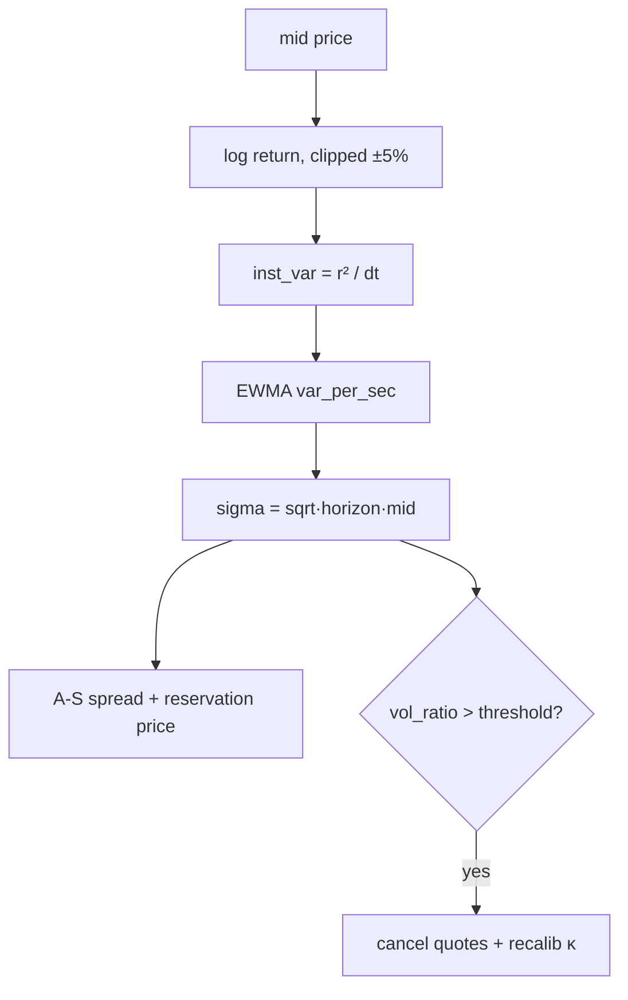
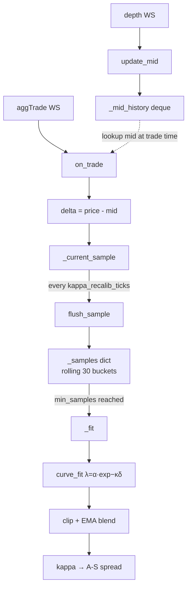

# market making bot

Inspired by the Avellaneda-Stoikov (2008) model. Supports live trading and backtesting on BTC/USDT from Binance.


## Strategy

We quote a bid and ask around a **reservation price** that adjusts with inventory, with a **spread** that widens with volatility and narrows with liquidity.
```
r = mid − q · γ · σ² · τ
δ = ½ [ γ · σ² · τ  +  (2/γ) · ln(1 + γ/κ) ]
```

## Files

| File | Description |
|---|---|
| `strategy.py` | Parameters, reservation price, optimal spread, quotes |
| `indicators.py` | EWMA volatility estimator + κ calibration via curve fit |
| `exchange.py` | Open orders, price-cross fill simulation, PnL |
| `market_maker.py` | Tick loop, order lifecycle, κ recalibration, logging |
| `orderbook.py` | Live order book — REST snapshot + WebSocket delta updates |
| `stream.py` | Streams Binance order book depth to parquet for backtesting |
| `logger.py` | Console logger |

## Live Data Flow

```
Binance depth WS  →  OrderBookManager  →  MarketMaker.on_tick()
Binance aggTrade WS  →  TradingIntensityIndicator.on_trade()
```

Both streams run as concurrent coroutines — trade events feed the κ estimator independently of the quote loop.

## Parameters

| Parameter | Default | Description |
|---|---|---|
| `gamma` | `0.1` | Risk aversion — fallback when `dynamic_gamma=False` |
| `kappa` | `1.5` | Order book depth — updated live by `TradingIntensityIndicator` |
| `infinite_horizon` | `True` | τ=1 always; set `False` for vol-driven τ decay |
| `tau_decay` | `0.5` | τ decay sensitivity when `infinite_horizon=False` |
| `dynamic_gamma` | `True` | Recompute γ each cycle from spread bounds and \|q\| |
| `inventory_risk_aversion` | `0.5` | Scales γ relative to its theoretical maximum |
| `gamma_cap` | `2.0` | Hard upper bound on dynamic γ |
| `min_spread` | `0.50` | Minimum half-spread (USD) |
| `max_spread` | `20.0` | Maximum half-spread — bounds dynamic γ |
| `vol_spike_threshold` | `2.0` | vol_ratio above this cancels quotes and forces κ recalibration |
| `max_inventory` | `0.05` | One-sided quoting beyond this threshold |
| `order_size` | `0.001` | Base order size in BTC |
| `eta_decay` | `0.0` | Size decay: `size = base · exp(−η·\|q\|)`. 0 = constant |
| `kappa_recalib_ticks` | `100` | Ticks between κ calibration windows |
| `kappa_sampling_length` | `30` | Rolling window size for κ estimation |
| `kappa_min_samples` | `10` | Minimum samples before κ estimation begins |

## Volatility



## κ Estimation




## Run

```bash
pip install -r requirements.txt

python market_maker.py backtest   # streams fresh data if parquet not found
python market_maker.py live       # logs quotes, no real order submission
```
